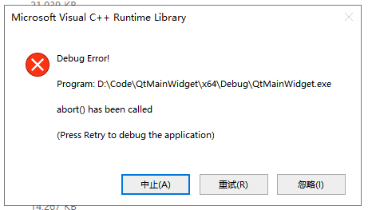
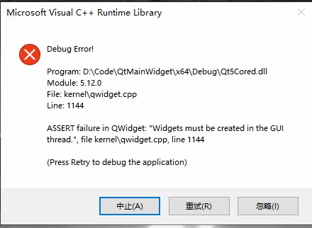
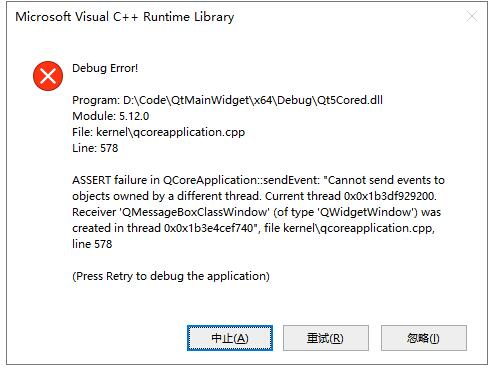
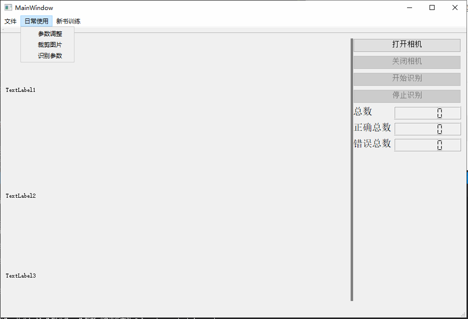
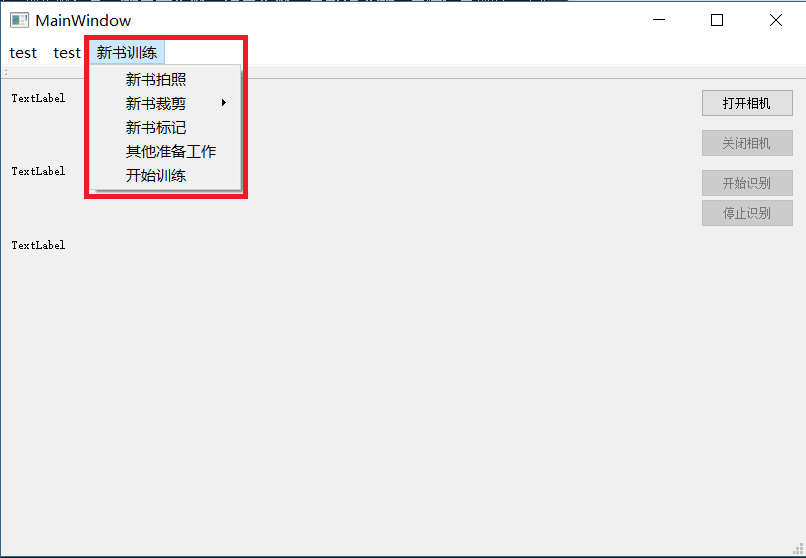

# 图书检测系统

## 简介
**以下为大华相机中的示例中的说明，做了一些修改，仅供参考，不具有绝对参考价值**
1. ~~本例程用于演示接口的使用方法，基于QT5.5.0开发，使用之前请先安装QT5.5.0或以上版本。~~
   本工程使用的vs2015进行开发，使用的Qt版本为5.12.0.OpenCV版本为3.4.6

2. ~~本例程使用MV Viewer版本为2.1.2_Build20180323，使用之前请先安装2.1.2_Build20180323版本MV Viewer~~更新到了2.2.2

3. 本例程不包含修改相机的IP，使用之前请先用MV Viewer修改相机的IP到网卡所在的网段。

4. 目录结构如下


	```
	/QMainWidget
		├ Bin      ： ImageConvert.dll用于图像格式转换，VideoRender.dll用来显示图像。
		│
		├ Include  ： 头文件
		│   ├ Media
		│   ├ GenICam     : SDK库的头文件。请配合所用MV Viewer版本里自带的头文件。(MV Viewer安装目录下\MV Viewer\Development\Include中)
		│   ├ Infra       ：SDK库的头文件。请配合所用MV Viewer版本里自带的头文件。(MV Viewer安装目录下\MV Viewer\Development\Include中)
		│   └ Memory      ：SDK库的头文件。请配合所用MV Viewer版本里自带的头文件。(MV Viewer安装目录下\MV Viewer\Development\Include中)
		│
		├ Depends  ：  编译时依赖库（大华相机中的lib）
		│   ├ ImageConvert.lib
		│   ├ VideoRender.lib  
		│   └ MVSDKmd.lib     ： SDK库。请配合所用MV Viewer版本里自带的头文件。(MV Viewer安装目录下\MV Viewer\Development\Lib中)
		│
		├ Src
		│   ├ mainwindow.h         ： 主界面头文件
		│   ├ mainwindow.cpp       ： 主界面实现
		│   ├ Config.h             ： 写入配置文件类头文件
		│   ├ Config.cpp           ： 写入配置文件类实现
		│   ├ takephoto.h          ： 拍照按钮弹窗
		│   ├ takephoto.cpp        ： 拍照按钮弹窗
		│   ├ alertwindow.h        ： 错误识别弹窗窗口
		│   ├ alertwindow.cpp      ： 错误识别弹窗窗口
		│   ├ MySerialport.h       ： 串口类头文件
		│   ├ MySerialport.cpp     ： 串口类实现
		│   ├ MessageQue.h         ： 帧缓存队列数据结构（必需！）
		│   ├ main.cpp             ： 主程序入口
		│   ├ parametersetting.h   ：设置参数窗口
		│   └ parametersetting.cpp ： 设置参数窗口
		│
		├ labelImg 标记图书软件	
		│
   		├ TemplateEditor 模板框定软件
    	│
   		├ 所有的ui文件
    	│
		└ QMainWidget.pro

	```
5. 接口使用时需要注意顺序。

	1. 先发现相机（CameraCheck），再连接相机（CameraOpen），连接相机以后才可以修改曝光和增益、改变触发方式。
	2. 开始采集（CameraStart）以后才可以显示图像，否则缓存队列为空。

6. 注意事项。
	1. 默认连接的是发现列表中的第一个相机。
	2. ShowImage接口没有获取图像功能（图像在回调函数中获取），只做显示用，需要给它传入一个指针pRgbFrameBuf，该指针指向要显示的图像数据。
	3. 目前工程只支持Mono8和RGB24图像数据转化成QImage，Mono8不需要转码可以直接生成QImage,其余格式通过ImageConvert库先转换成RGB24再生成QImage
	4. Sample中通过QLabel显示图像，QLabel只支持QPixmap。所以先将QImage转换为QPixmap，转换会造成图像显示延迟。
	5. 如何生成QImage请参照dahua.cpp中的ShowImage函数， 非mono8格式转码为RGB24请参照dahua.cpp中的DisplayThreadProc函数

<center> END </center>

----
以下为添加内容

## 默认配置项

* 新书拍照保存的位置是在 `Train/image/Pic.bmp`
* 标记文件保存的位置是在 `Train/label/`
* 裁剪完之后配置文件会把书的位置信息保存起来，并将新书图片进行裁剪，代码`on_actionOpenCutWindow_triggered()`
* 新书训练的步骤：先拍照，照片保存，然后用裁剪工具裁剪，裁剪完之后复制，之后标记，标记文件复制。
  复制了之后文件移动，


### 未实现
1. ~~参数修改。自动提取识别到相关的参数信息。并将参数写进到配置文件中。能够**保存**每一本书的参数信息，能够修改没本书的参数信息~~  能够实现参数保存
2. 参数的自动拟合，自动修正功能。能够自动修正参数信息，提供给用户是否要自动修复参数。
3. 

----

### 2020.03.14 总结一下已经实现的工作：打开相机、显示图像这些功能已经在原始的代码中实现。
- 新添加的功能有：将相机改为硬件除法、并将图像显示在label上，label_2显示图书部分，Label_3显示是否有误。
- 添加了识别部分的代码，已经测试功能正常。
- 新加了LCD显示屏显示数量，但是效果不好，想着改为label显示
- 添加了数据库，不知道能否正确实现增删改查功能，不知道如何查看

### 20200316周：要实现自动化训练部分所需要的脚本代码，能实现一键训练功能。具体的功能如下：

- [ ] 1. 新书拍照。在菜单中添加拍照的菜单，实现将实时视频流保存为图片。
	- [x] 保存在指定位置。(位置移动)
- [x] 2. 新书截图。借助之前的画模板的程序
	- [x] 在新书图片截取图书，并将图书位置等相关信息输出。对新书图片裁剪。
	- [x] 新书的批量复制（代码已实现，具体位置之后再定）
	- [x] 图片文件进行处理：调整亮度实现多张照片的效果。
	- [x] 图片文件移动到相应的文件夹中
- [x] 3. 图书标记。
	- [x] 调用打标签的程序打标签
	- [ ] 标签文件的修改和训练数据的产生（程序在新机器上）
	- [x] 标签的批量复制
	- [x] 标记文件移动到相应的文件夹中
- [x] 4. 修改训练配置文件
- [x] 5. 训练模型。**代码已实现，但是未运行测试**
- [ ] 6. 得到的模型移动到指定位置？或者采用final weight？(确定之后在配置文件中确定此项)

照片和标记文件的移动和复制代码在F:\\code\\python\\WechatPicTrans\\copyfile.py
 <!--<u>**训练模块完成**</u>-->

### 20200407周：
- 实现了参数调整窗口。在主窗体菜单栏点击菜单选项可以打开参数设置窗口，并将现在使用的参数传递到参数设置窗口中，参数修改完成后可以将参数保存。
  修改的参数包括黑色小块的个数N，线性拟合的三个参数k/b/s。
- 实现了出现错误时的三种报警信息：声音报警、弹窗报警、气缸弹书。识别到错误时，会发出错误信号，执行错误指令。
- 添加了日常使用菜单。包括参数调整，图书位置框选。
- 将配置信息保存在配置文件中

参数的自动化调整？区间阈值标准参数等。

### 20200413周工作总结：
- 撰写图书识别系统的项目介绍文档。
- 将新书训练模块中的`拍照`菜单改为了软件触发模式。点击菜单弹出一个按钮弹窗，点击弹窗中的按钮进行拍照，并将图片保存到指定目录`Train\image\Pic.bmp`
- 新书训练菜单中增加一个`删除训练样本`菜单,删除之前的样本照片和标记文件，解决每次重新添加训练数据时样本名称冲突问题。
- 代码重构。更改文件移动，图书标记、图片框选里的代码。


### 20200420周工作总结：
- 裁剪图片部分添加了hash校验模板图片，防止每次打开templateEditor都对Pic.bmp进行裁剪
- 参数调整窗口中添加了三个阈值调整，但是未实现
- LCDNumber实现了简单计数
- Label_2能够将识别之后的框画出来并显示出来
- TemplateEditor返回值有错误进行了修改
- 更改了应用图标，更改了生成文件的名称，更改生成目录为`x64/release/` 和`x64/debug/`，release下的exe可以直接运行，弃用Qt中的生成目录`release`和 `debug`,算是解决了release下exe不能直接执行的问题

### 20200427周工作总结：
- 运行大批量的图片闪退的问题
- testrun函数中label显示完之后delete了img就不报错了……内存没有回收吗？？？显示完图片之后确实没有回收内存
- 在config.ini文件中添加了log日志部分，主要用于监测是在哪个函数中出现了问题

- 添加了所有的依赖dll文件之后出现的新的问题




1. 写文档总结遇到的问题和解决方案
2. 形成V1.0版本，打包相关文件
3. 界面优化美化，启动界面添~~加nssc大楼启动界面~~（启动动画）皇家新村牌楼照片；
4. 生成安装包，可执行安装的exe


## 使用手册

### 日常使用
    点击打开摄像头->开始识别，开始识别使用

### 不需要训练的新书


1. 在新书训练菜单中点击新书拍照，图片保存在`Train\image\Pic.bmp`，打开，框选图书位置，右键导出，保存在根目录的moban.png。图书被裁剪。
2. 点击`识别参数`菜单会对裁剪之后的图书识别参数，并将参数信息保存在`release\config\conf.ini`下，并将参数传递给类变量（似乎并没有传递成功？）识别完成之后会弹窗提示识别完成。
3. 点击开始识别即可使用。

### 新书训练
新书训练按照新书训练主菜单中的顺序依次点击完成即可


1. 新书拍照。把书放到传送带上，**摆正**，（添加一个仿射变换？）然后点击拍照。
2. 新书裁剪。新书裁剪菜单中先打开裁剪窗口，框选图书部位，然后导出模板，关闭窗口。之后再点击裁剪图片菜单，完成图片裁剪。
3. 新书标记。点击新书标记裁剪，打开标记软件，框选中书中的每一个黑色标记，尽量准确。保存标记文件，完成标记工作。
4. 新书图像和标记文件的批量生成，位置移动，只需点击其他准备工作按钮即可。
5. 开始训练，点击此按钮后开始学习新的图书。此过程大概需要一个小时左右。


## 知识补充

// QVariant转QString
https://blog.csdn.net/soulwyb/article/details/100010074
QVariant qv;
QString qs = qv.toString();
 
// QString 转 QVariant
 
QString qs;
QVariant qv(qs);


## 目前存在的问题
1. 双击release下的exe文件不能打开，闪都不闪，直接没反应 
2. 识别时闪退。连接相机进行识别时，运行一会就会闪退；识别本地图片文件时，没有这种现象（在之前的命令行中。改为Qt之后没有试过）
3. 调用其他exe时闪退。调用的exe包括TemplateEditor.exe（框定图书用，之前是画模板的那个）、labelImg.exe图书标记软件，关闭弹出的exe之后，主窗口闪退。
4. 执行其他的命令时闪退，图书拍照、识别参数。图书拍照采用的是设置了一个参数，点击按钮之后将参数改为true，拍照保存图片，并将参数改为false。有时候能用有时候就会闪退。相机采用的是连续拉流。
识别参数是用训练好的模型去识别当前这本书，然后将识别到的数量和拟合的直线的参数保存起来，同时传给类内属性参数

5. labelImg.exe 打不开，闪退（SHELLEXECUTEINFO 不能打开命令行？）。之前是直接打开标记软件，可以打开，现在在py文件中添加了复制文件，就不能打开了。但是直接双击labelImg是可以打开的。
6. 屏幕窗口大小适宜问题，缩放屏幕图片大小调整问题。
7. 

### 急需解决
- 列出来要解决的问题


- 弹窗要明显
- 现有功能完善，能够使用
##

