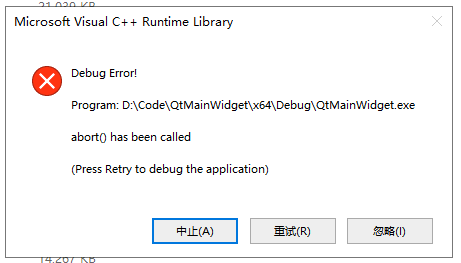
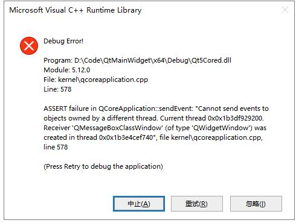

## 周报
### 2020.03.14 总结一下已经实现的工作：打开相机、显示图像这些功能已经在原始的代码中实现。
- 新添加的功能有：将相机改为硬件除法、并将图像显示在label上，label_2显示图书部分，Label_3显示标记的图书。
- 添加了识别部分的代码，已经测试功能正常。
- 新加了LCD显示屏显示数量，但是效果不好，~~想着改为label显示~~，使用LCDNUmber显示，
    - 具体实现方式：设有全局变量：total_number、sum_of_correct、sum_of_wrong分别存储图书总数、正确总数、错误总数，每次硬件触发之后总数+1，识别之后相应结果+1，并更新显示LCDNumber显示的数字问题。
    - 为保持重新打开之后数量记忆，每次会将三个数字同时写入文件，使用的是`Config.Set()`函数进行写入，软件打开初始化时会调用`Config.get()`从文件中读取相应值。
    - 现在数值的读写已经注释掉，每次写入时会报错
    - **代码调试时也可以用此`类方法`打日志，查找问题**
- 添加了数据库，**不知道能否正确实现增删改查功能，不知道如何查看**

### 20200316周：要实现自动化训练部分所需要的脚本代码，能实现一键训练功能。具体的功能如下：

- [x] 1. 新书拍照。在菜单中添加拍照的菜单，实现将实时视频流保存为图片。（0413周实现）
	- [x] 保存在指定位置`Train/image/Pic.bmp`。(位置移动)
- [x] 2. 新书截图。借助之前的画模板的程序
	- [x] 在新书图片截取图书，并将图书位置等相关信息输出。对新书图片裁剪。
	- [x] 新书的批量复制（代码已实现，具体位置之后再定）
	- [x] 图片文件进行处理：调整亮度实现多张照片的效果。
	- [x] 图片文件移动到相应的文件夹中
- [x] 3. 图书标记。
	- [x] 调用打标签的程序打标签
	- [ ] 标签文件的修改和训练数据的产生（程序在新机器上）
	- [x] 标签的批量复制
	- [x] 标记文件移动到相应的文件夹中
- [x] 4. 修改训练配置文件
- [x] 5. 训练模型。**代码已实现，但是未运行测试**
- [ ] 6. 得到的模型移动到指定位置？或者采用final weight？(确定之后在配置文件中确定此项)

照片和标记文件的移动和复制代码在F:\\code\\python\\WechatPicTrans\\copyfile.py
 <!--<u>**训练模块完成**</u>-->

### 20200407周：
- 实现了参数调整窗口。在主窗体菜单栏点击菜单选项可以打开参数设置窗口，并将现在使用的参数传递到参数设置窗口中，参数修改完成后可以将参数保存。
  修改的参数包括黑色小块的个数N，线性拟合的三个参数k/b/s。
- **串口通讯已实现**实现了出现错误时的三种报警信息：声音报警、弹窗报警、气缸弹书。识别到错误时，会发出错误信号，执行错误指令。
- 串口通讯实现部分闪退原因是需要在根目录下添加一个`config`的文件，可以修改源文件放到`Config/conf.ini`。
- 添加了日常使用菜单。包括参数调整，图书位置框选。
- 将配置信息保存在配置文件中，配置文件的位置是`Config/conf.ini`

### 20200413周工作总结：
- 撰写图书识别系统的项目介绍文档。
- 将新书训练模块中的`拍照`菜单改为了软件触发模式。点击菜单弹出一个按钮弹窗，点击弹窗中的按钮进行拍照，并将图片保存到指定目录`Train\image\Pic.bmp`
- 新书训练菜单中增加一个`删除训练样本`菜单,删除之前的样本照片和标记文件，解决每次重新添加训练数据时样本名称冲突问题。
- 代码重构。更改文件移动，图书标记、图片框选里的代码。

### 20200420周工作总结：
- 裁剪图片部分添加了hash校验模板图片，防止每次打开templateEditor都对Pic.bmp进行裁剪
- 参数调整窗口中添加了三个阈值调整，但是未实现
- LCDNumber实现了简单计数
- Label_2能够将识别之后的框画出来并显示出来
- TemplateEditor返回值有错误进行了修改
- 更改了应用图标，更改了生成文件的名称，更改生成目录为`x64/release/` 和`x64/debug/`，release下的exe可以直接运行，弃用Qt中的生成目录`release`和 `debug`,算是解决了release下exe不能直接执行的问题

### 20200427周工作总结：
- 运行大批量的图片闪退的问题
- testrun函数中label显示完之后delete了img就不报错了……内存没有回收吗？？？显示完图片之后确实没有回收内存
- 在config.ini文件中添加了log日志部分，主要用于监测是在哪个函数中出现了问题

    
- 添加了所有的依赖dll文件之后出现的新的问题
    

    

1. 写文档总结遇到的问题和解决方案
2. 形成V1.0版本，打包相关文件
3. 界面优化美化，启动界面添~~加nssc大楼启动界面~~（启动动画）皇家新村牌楼照片；
4. 生成安装包，可执行安装的exe

### 20200518 总结
1. 灵活设置判别标准在实现方面改动比较大，目前暂时没有太大的急需，暂时放缓此功能
2. V字形的字典做成一个专用软件，与主版本区分开，只用来识别字典
3. 解决串口通信闪退问题，将串口通讯加入到程序中
4. 软件发布，尝试release下的exe的发布，解决依赖库的问题